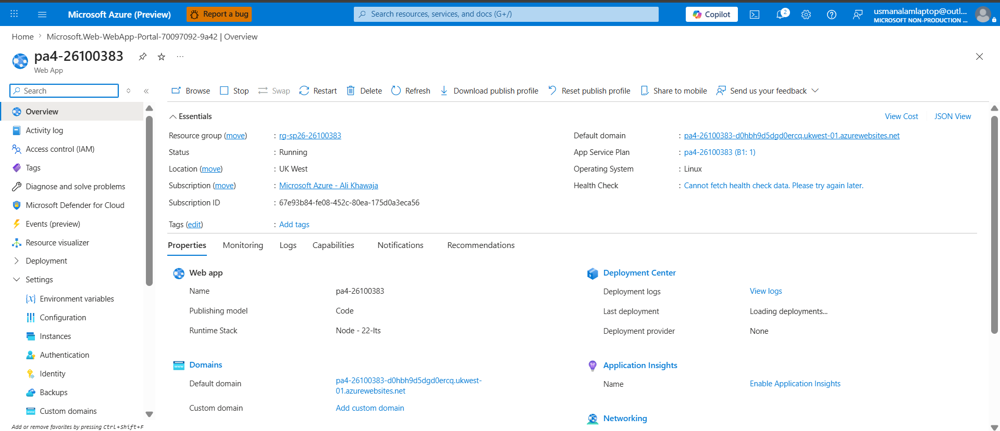
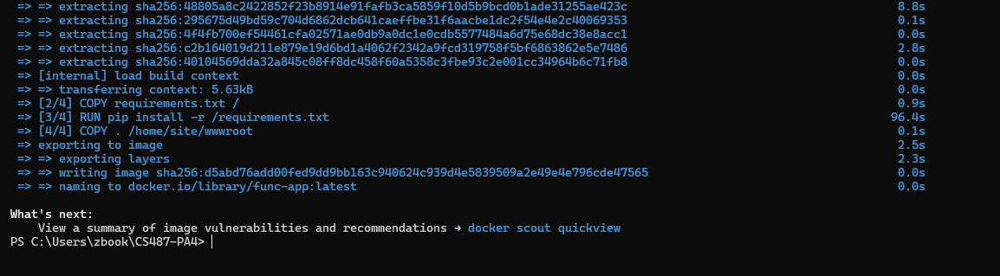
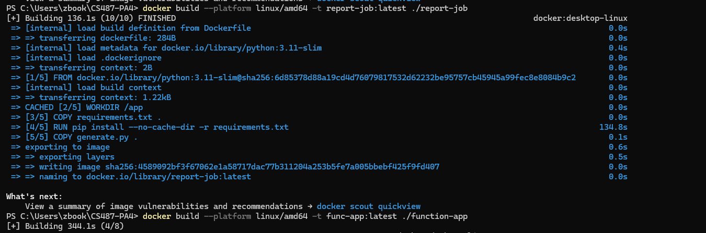
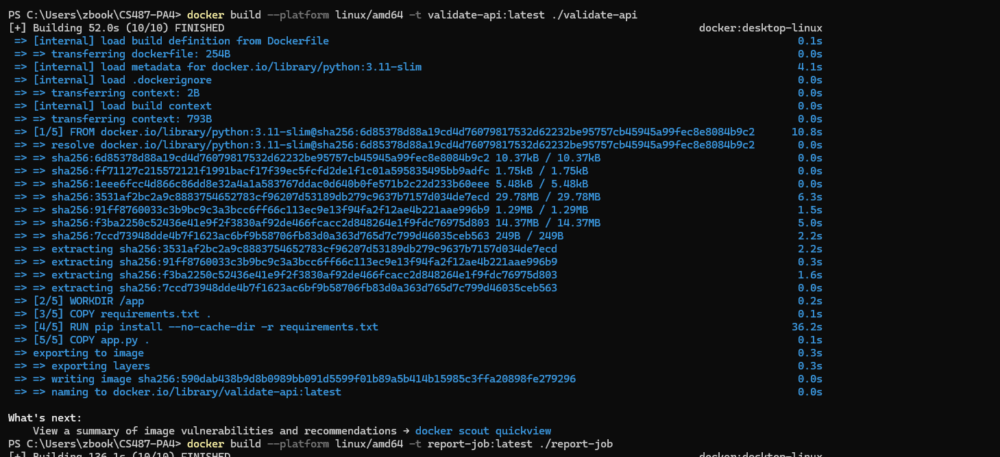
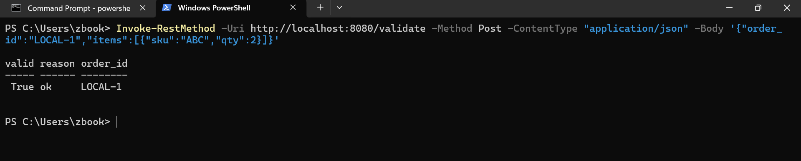
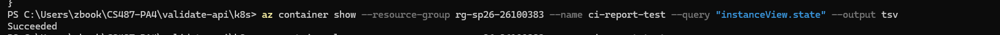
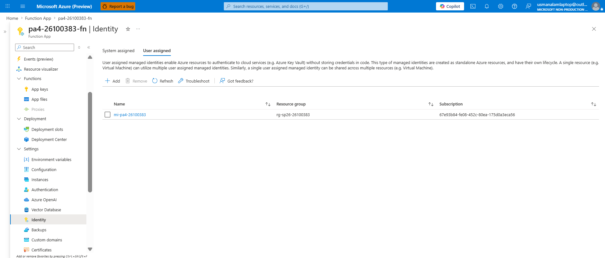
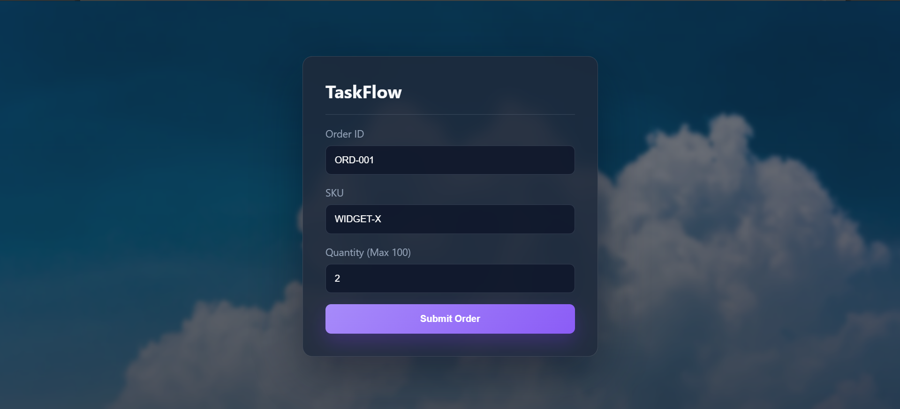
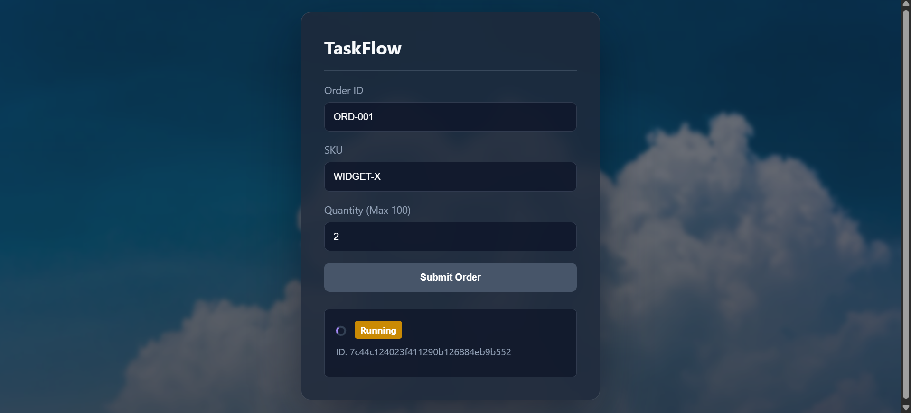
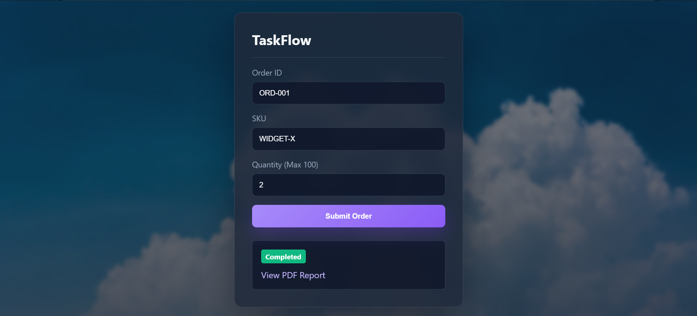

# PA4 Submission: TaskFlow Pipeline

## Student Information

| Field | Value |
|---|---|
| Name | Choudhary Usman Alam |
| Roll Number | 26100383 |
| GitHub Repository URL | https://github.com/Usman-Alam-82/CS487-PA4 |
| Resource Group | rg-sp26-26100383 |
| Assigned Region | UK West |

## Evidence Rules

- All images use relative paths from the repository root.
- Every screenshot below has a short caption explaining what it proves.
- Portal screenshots show the Azure resource name and the relevant page context.
- CLI screenshots show the command and the output.
- Secrets, passwords, and connection strings are masked or omitted.

---

## Task 1: App Service Web App (15 points)

### Evidence 1.1: Forked Repository

Description: This shows the GitHub fork that I used as the working repository for PA4. It confirms that the assignment was completed inside my own copy of the starter repository rather than in the instructor source repo.

### Evidence 1.2: App Service Overview

Description: This is the App Service overview page for the TaskFlow web app. It shows the deployed web app resource, its running state, the resource group, and the Azure region used for the frontend.

### Evidence 1.3: Deployment Center / GitHub Actions

Description: This screenshot shows the deployment wiring between the App Service and my GitHub repository. It proves the web app is connected to source control and can be updated through the deployment workflow instead of manual uploads.

### Evidence 1.4: Live Web UI

Description: This is the TaskFlow UI loaded in the browser from Azure App Service. It confirms the frontend is being served successfully and the deployed site is reachable from the public URL.

### Evidence 1.5: App Settings / Environment Variables

Description: This screenshot shows the web app configuration, including FUNCTION_START_URL and FUNCTION_STATUS_URL. These settings are what allow the browser UI to start a Durable orchestration and then poll for progress and completion.

---

## Task 2: Azure Container Registry (15 points)

### Evidence 2.1: ACR Overview

.png)

Description: This screenshot shows the Azure Container Registry overview for pa426100383. It confirms the registry name, SKU, login server, resource group, and region used to store the container images for this PA.

### Evidence 2.2: Docker Builds

Description: This build output shows the validate-api image being built locally. It proves the AKS validator image was produced successfully before being pushed to ACR.

Description: This build output shows the report-job image build completing successfully. It is the one-shot container used later by ACI to generate and upload PDF reports.

Description: This build output shows the func-app image build completing successfully. It is the container image that runs the Durable Function orchestrator and activities.

### Evidence 2.3: ACR Repositories

Description: This portal screenshot shows the pushed repositories stored inside ACR. It confirms that the three required images are present in the registry and available for downstream deployment.

Description: This output supports the image push workflow from the terminal side. Together with the portal view, it shows that the registry accepted the images instead of only building them locally.

---

## Task 3: Durable Function Implementation (12 points)

### Evidence 3.1: Completed Function Code

[function_app.py](function-app/function_app.py)

Description: The Durable Function implementation starts with an HTTP-triggered starter, then runs an orchestrator that calls validate first and report second. If validation fails, the orchestrator returns a rejected result immediately; if validation succeeds, it creates the report job and returns the PDF URL.

### Evidence 3.2: Local Function Handler Listing

Description: This local runtime output shows the Durable Functions host discovering the HTTP starter, orchestrator, and activity handlers. It confirms the function app container was structured correctly and the runtime could load the expected handlers.

---

## Task 4: Function App Container Deployment (8 points)

### Evidence 4.1: Function App Container Configuration

Description: This screenshot shows the Function App configured to use the container image from ACR. It proves the deployed Function App is running the custom func-app image rather than a default platform image.

### Evidence 4.2: Orchestration Smoke Test

Description: This is the HTTP starter response from the Durable Function. The returned instance id and statusQueryGetUri prove that the orchestration started correctly and exposed the normal Durable Functions status endpoints.

### Evidence 4.3: Expected Failed Status Before Downstream Wiring

Description: This status query output shows the orchestration state after the first end-to-end test flow was wired. It is the kind of output expected when the orchestration has started but a downstream setting or dependency is still being verified.

---

## Task 5: AKS Validator (15 points)

### Evidence 5.1: AKS Cluster

Description: This screenshot shows the AKS cluster pa4-26100383 in UK West with the cluster in a running state. It also shows that the cluster has a single node pool and is fully provisioned under the assigned resource group.

### Evidence 5.2: Kubernetes Nodes and Pods

Description: This output shows the AKS node is ready and reachable through kubectl. It confirms the cluster is operational and the node pool is active.

Description: This output shows the validate deployment pod is running successfully. It proves the validator container was scheduled in the cluster and is not crash-looping.

### Evidence 5.3: Kubernetes Service

Description: This screenshot shows the LoadBalancer service for the validator API and its external IP. It confirms the AKS service is reachable from outside the cluster on the expected port.

### Evidence 5.4: Validator API Tests

Description: This terminal output shows the validator health endpoint returning HTTP 200 and the validate endpoint accepting a valid order. It also shows the rejection rule working as intended when quantity exceeds 100.

### Evidence 5.5: Function App VALIDATE_URL

Description: This is the Function App and Web App environment configuration showing the validator URL that points at the AKS LoadBalancer IP. It is the wiring that lets the Durable Function validate orders through the AKS service.

### Evidence 5.6: AKS Idle Behavior

Description: This portal view shows the cluster still present and running even when no order is being processed. The node-backed AKS service remains allocated, which means the cluster continues to exist and incur baseline cost while idle.

---

## Task 6: ACI Report Job (15 points)

### Evidence 6.1: Blob Container

Description: This screenshot shows the reports blob container inside the storage account used by the report job. It is the destination where each generated PDF is uploaded.

### Evidence 6.2: Manual ACI Run

Description: This output shows the manual Azure Container Instance creation returning created true. It confirms the report container group was created successfully as a one-off job.

Description: This command output shows the container group finishing in the Succeeded state. That is the expected behavior for a one-shot report generator that uploads the PDF and then exits.

### Evidence 6.3: ACI Logs

Description: This CLI capture confirms the report container group completed successfully from the terminal side. A direct az container logs screenshot was not present in the repo, so this is the closest existing terminal evidence for the ACI run.

### Evidence 6.4: Generated PDF

Description: This storage account view shows the generated PDF uploaded into the reports container. It proves the ACI job wrote the file to Blob Storage successfully.

Description: This view confirms the PDF exists as a real blob object and can be opened from storage. It is the strongest proof that the report job completed end-to-end and persisted the file in Blob Storage.

### Evidence 6.5: Function App Managed Identity and IAM

Description: This screenshot shows the Function App identity page with the user-assigned managed identity attached. The report activity uses this identity so the Function App can authenticate to Azure resources without storing Azure credentials in code.

TODO: Add the Access Control (IAM) screenshot that shows the Contributor-style role assignment on rg-sp26-26100383.

Description: The missing IAM screenshot should show the Function App's identity receiving permission to create and delete ACI resources in the resource group. That is the specific evidence the grader will expect for this requirement.

### Evidence 6.6: Report App Settings

.png)

Description: This configuration page shows the report-related settings used by the Durable Function. REPORT_RG, REPORT_LOCATION, REPORT_IMAGE, ACR settings, STORAGE settings, and SUBSCRIPTION_ID are all required so the report job can be created and upload its PDF to storage.

---

## Task 7: End-to-End Pipeline (15 points)

### Evidence 7.1: Web App Wiring

Description: This screenshot shows FUNCTION_START_URL and FUNCTION_STATUS_URL configured on the App Service. It is the backend wiring that lets the frontend start a Durable orchestration and then poll the status URL until the workflow finishes.

Description: This resource group view shows the full set of Azure services used by the pipeline in one place. It confirms that the web app, function app, AKS cluster, ACR, storage account, and supporting identity resources all belong to the assigned resource group.

### Evidence 7.2: Happy Path UI

Description: This screenshot shows the TaskFlow form before submission with a valid order payload. It is the starting point for the happy-path orchestration test.

Description: This screenshot shows the frontend polling the Durable Function and displaying a running state. It proves the web app successfully started the orchestration and is tracking the instance status.

Description: This screenshot shows the order completing and the PDF report link appearing in the UI. It confirms the full pipeline succeeded from browser input through validation, ACI report generation, and Blob Storage upload.

### Evidence 7.3: Backend Participation

Description: This screenshot shows the Function App invocation evidence for the order run. It links the browser submission to the backend orchestration and proves the function app was actively participating in the workflow.

Description: This pod log view shows the validator container being used during the pipeline run. It is the backend proof that the Function App reached the AKS service as part of the validation step.

Description: This CLI output shows the PDF being downloaded directly from Blob Storage. It confirms the generated report is not only visible in the portal but can also be retrieved from storage programmatically.

Description: This screenshot shows the generated report blob in the storage account portal. It is the storage-side proof that the report artifact exists for the same successful order.

Description: This screenshot shows the PDF opened from storage. It confirms the uploaded file is a valid report document and not a broken blob object.

### Evidence 7.4: Reject Path UI

Description: This screenshot shows the browser UI rejecting an order where quantity exceeds 100. Because the validator returns invalid, the pipeline stops before creating a new report ACI, which is the intended behavior.

Description: This screenshot shows the front end in a failed state for the rejected order path. It reinforces that invalid orders are blocked before report generation starts.

Description: This is a second rejected-path screenshot showing the same validation failure from another capture point. Having more than one evidence image here makes the reject behavior easier to verify.

---

## Task 8: Write-up and Architecture Diagram (5 points)

### Evidence 8.1: Architecture Diagram

TODO: Add the architecture diagram file to docs/ and link it here before final submission.

Description: The final diagram should show GitHub to App Service CI/CD, the Web App to Durable Function start and status polling flow, Function App to AKS validation, Function App to ACI report creation, ACI to Blob Storage PDF upload, ACR feeding images to Function App/AKS/ACI, and the managed identity relationship between the Function App and the resource group.

### Question 8.2: Service Selection

TaskFlow uses App Service for the web frontend because it is the simplest managed option for hosting a small Node.js dashboard with public access, built-in deployment integration, and predictable fixed pricing. It is the right tool for a UI that should stay available all the time without the overhead of managing VMs or containers directly.

Durable Functions is the right fit for the orchestration layer because the workflow is not a single request; it is a stateful sequence that must validate, wait on downstream work, and return a final status later. The Durable runtime gives us state persistence, replay, and check-pointed progress without forcing the browser or the frontend to hold the workflow open.

AKS is the best home for the validator because it is a long-running containerized API that benefits from stable networking, a LoadBalancer service, and easy scaling of the validation pods if traffic grows. The cost model is more like paid cluster capacity than per-request billing, so it is appropriate for a service that stays online and serves repeated validation calls.

ACI fits the report job because the PDF generation step is ephemeral and should exist only for the lifetime of one order. That makes per-second billing attractive, and the operational model is ideal for a job that needs to run, upload a report, and terminate cleanly without managing a dedicated server.

### Question 8.3: ACI vs. AKS

When AKS is idle for 10 minutes, the cluster does not disappear; the node pool remains allocated and the VM-backed node keeps running unless autoscaling or scale-to-zero has been deliberately configured. In practice, idle AKS still means paying for the cluster capacity even when there are no active orders to process.

For ACI, idle means there is no running container group after the job finishes. In this pipeline, the report container is created only when an order reaches the report stage, uploads the PDF, and then exits, so the container does not sit around consuming cost after the work is done.

If a malicious user spammed Submit 1000 times in a minute, the service most exposed to extra cost would usually be ACI, because every successful order could create a new per-run container group that bills during execution. AKS would also handle more traffic, but its cost is mostly already committed capacity rather than a fresh charge per report run, so the marginal cost grows more slowly than ACI.

### Question 8.4: Durable Functions vs Plain HTTP

Implementing the same flow as two plain HTTP-triggered functions would be much harder because the report step can take up to a minute and regular HTTP request handling is a poor place to hold long workflow state. The orchestration would need custom client-side or server-side coordination to remember whether validation already succeeded, whether the report step started, and what status to return later.

Durable Functions solves at least two concrete problems here. First, it preserves state across waits and retries so the orchestration can resume safely without losing progress. Second, it gives us a built-in retry and status model, which avoids having to hand-roll timeouts, duplicate submission protection, and status polling endpoints for every step in the pipeline.

### Question 8.5: Cost Review

TODO: Add the Cost Management screenshot scoped to rg-sp26-26100383.

Description: Based on the architecture, the most expensive resource is usually the AKS node pool because it runs continuously even when the validator is idle. The ACI report container is only billed while it exists, and the App Service and Function App are typically smaller steady costs than a running VM-backed cluster.

### Question 8.6: Challenges Faced

One issue I hit was an InvalidImageName-style deployment failure in AKS because the image name in the Kubernetes YAML did not exactly match the repository name in ACR. The fix was to correct the image reference and recheck the deployment YAML so the validator pod could pull the expected validate-api:v1 image.

Another issue came from creating the report ACI manually in PowerShell: the JSON environment value lost its quotation marks and the Python job crashed with a JSONDecodeError. I debugged that by escaping the string correctly for PowerShell, then rerunning the container creation until the report job could parse ORDER_JSON and upload the PDF.

---

## Final Note

The architecture diagram and Cost Management screenshot are intentionally left as TODO placeholders for now, as requested. Everything else in this submission file is populated with the current repo evidence and the completed report text.